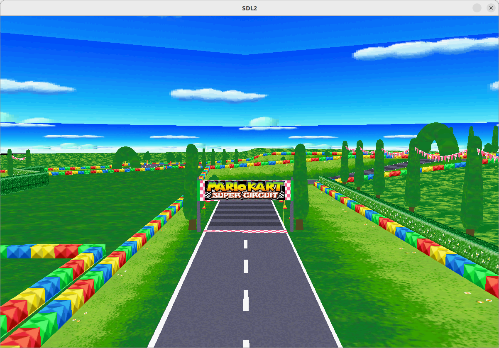

# 3D renderer in C from scratch

This is a 3D renderer written in C without any 3D library. I only used SDL to make a window and handle events. I just have a grid of pixels that I modify.

Features implemented:
- Read an .obj file. It only works with triangle faces (no quads). You can convert from quads to triangles with "models/poly to triangle.py".
- 3D projection
- Rasterization
- Textures
- Camera movement: Use ZQSD or WASD to move, SPACE or LSHIFT to go up or down, and the mouse to rotate.
- Camera clipping

## Build and run
```
make compile
```
Then
```
make run
```

You can change the file in the Makefile.

## Model used
gba peach circuit by amogusstrikesback2 https://skfb.ly/oJQYQ

## Photos
